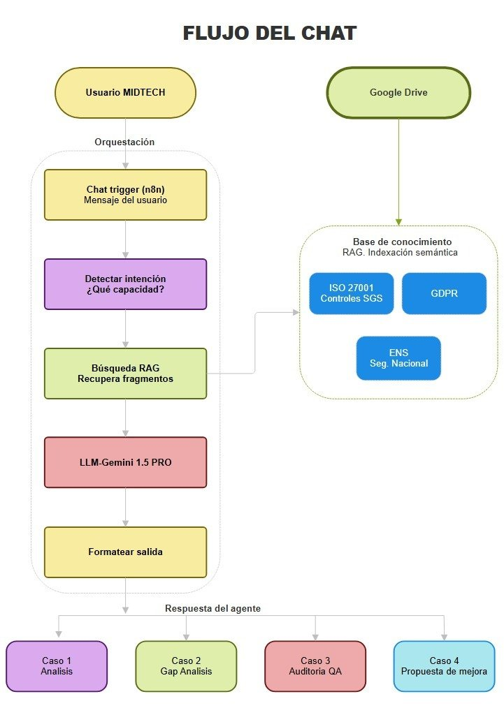
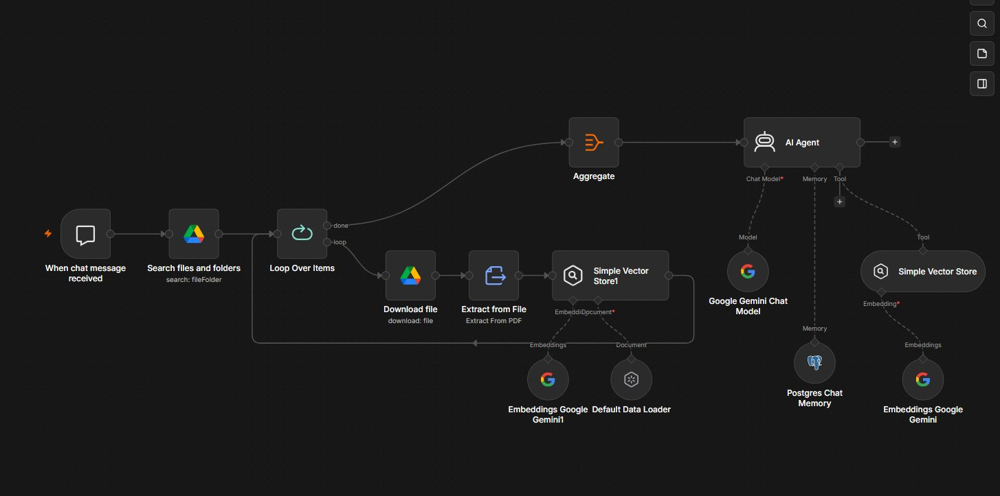
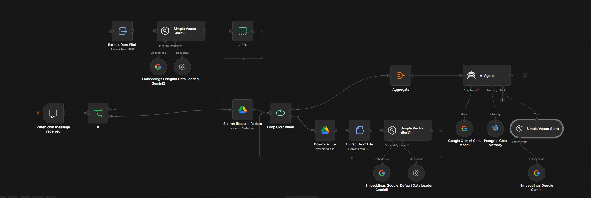

# TFC-Asistente-INCLUDE
Asistente de ciberseguridad  con IA construido en n8n para el TFC #include13. Audita políticas de seguridad contra ISO 27001, GDPR, ENS y NIS2 mediante RAG. Detecta incumplimientos, responde preguntas de auditoría y propone mejoras. 

---

# Fase 1 - Diseño del asistente
*TFC #include13 · MIDTECH S.A.*

## 1. Descripción del problema y para quién es
La empresa MIDTECH necesita un asistente que automatice un apartado importante de la seguridad, generando un auditor de IA que analice sus políticas de seguridad para detectar riesgos e incumplimientos, usando como fuente ISO 27001, GDPR y ENS, respondiendo a las preguntas de una forma estructurada y también proponiendo medidas de mejora para la seguridad de la empresa.

## 2. Flujo completo - qué entra, qué procesa y qué sale

### C1 - Análisis de la política
El cliente sube el documento que se va a analizar, el asistente lo procesa, lo indexa y responde con un análisis con tres secciones marcadas:
- Áreas cubiertas
- El nivel de detalle con el que procede
- Ámbitos que quedan sin tratar
Citará partes concretas del documento y razonará la respuesta en base al fragmento rescatado.

### C2 - Gap analysis (incumplimientos)
El asistente comparará el documento aportado por el cliente con la base de datos de normativa (ISO 27001, GDPR y ENS) y devolverá los incumplimientos detectados con esta estructura:
- Área normativa sobre la que existe el riesgo o incumplimiento
- Carencia detectada y una descripción de ella
- Nivel de criticidad
- Referencia normativa

### C3 - Preguntas de auditoría
El cliente pregunta al asistente sobre su política o la normativa de seguridad genérica. El asistente responde citando ambos documentos: tanto el aportado por la empresa como los de la base de conocimiento.

### C4 - Propuestas de mejora
El asistente recapitulará toda la información y devolverá por orden de prioridad una lista de mejoras, la normativa sobre la que apoya cada propuesta y cuánto esfuerzo causarían los cambios.

## 3. Herramientas elegidas

**Modelo de lenguaje (LLM):**
Gemini 1.5 Flash para comprobar que el flujo funciona bien, ya que consume menos cuota diaria. Luego se cambia a Gemini 1.5 Pro, que es una opción gratuita y potente con una ventana de contexto muy amplia y más precisa para lo que requiere el proyecto.

**Herramienta de orquestación:**
Al investigar sobre Make y n8n, n8n me pareció más sencilla y potente. Además es más conocida, al menos para mí, y hay mucho más contenido en internet sobre n8n en el que apoyarme.

**Gestor documental:**
Mi elección es Google Drive, ya que es una herramienta que uso en mi día a día y conozco su potencia y capacidad.

## 4. Diagrama visual del flujo - versión inicial
Este es el flujo que diseñé al principio del proyecto. El usuario manda un mensaje, el sistema detecta qué tipo de consulta es, busca en la base de conocimiento, genera la respuesta con el LLM y la devuelve formateada según la capacidad activada.


*Figura 1 - Flujo del chat diseñado en la fase 1 del TFC*

## 5. Cómo ha evolucionado el flujo durante el proyecto
Una vez empecé a montar el asistente en n8n lo primero que construí fue un flujo básico sin ningún tipo de bifurcación. Todos los documentos venían de Google Drive: el sistema buscaba los archivos en una carpeta, los descargaba, extraía el texto y los indexaba. Sin más.


*Figura 2 -Flujo intermedio en n8n: la política de MIDTECH había que copiar el texto a mano en el chat, no se podía adjuntar el PDF directamente*

Este flujo funcionaba, pero con una limitación bastante incómoda: para auditar la política de MIDTECH el usuario tenía que copiar el texto del documento a mano y pegarlo directamente en el chat. No había forma de adjuntar el PDF como fichero. La normativa sí llegaba bien desde Drive, pero la política a auditar dependía de que el usuario copiase y pegase el contenido, lo cual no es práctico para un documento de decenas de páginas.

Cuando entendí mejor cómo funcionaba el flujo por dentro, añadí un nodo IF al principio para separar los dos casos: si el usuario adjunta un PDF en el chat, ese fichero se procesa directamente. Si no adjunta nada, el flujo va a buscar los documentos de Drive como hacía antes.

- Antes: todo pasaba por Google Drive sin diferencia entre política y normativa.
- Después: el nodo IF separa los dos tipos de documento.
- Resultado: la política la manda el usuario en el chat y la normativa se carga sola desde Drive.

## 6. Desarrollo del prompt del sistema
El prompt que le indica al agente cómo tiene que comportarse también tuvo que pasar por varias versiones. Aquí explico cómo fue evolucionando y por qué tuve que cambiarlo.

### Versión 1 - primera prueba, lo más básico
Para empezar, escribí algo muy sencillo solo para ver si el flujo funcionaba. Sin estructura, sin capacidades, solo la idea principal.

```
Eres un asistente de ciberseguridad que audita políticas de seguridad.
Cuando el usuario te mande un documento analízalo y compáralo con
ISO 27001, GDPR y ENS.
```

Funcionaba para hacer pruebas básicas pero el agente no tenía ni idea de cómo responder ni qué formato usar. Había que darle más instrucciones.

### Versión 2 - añadiendo las cuatro capacidades
En la segunda versión le expliqué al agente las cuatro cosas que puede hacer y le di ejemplos de frases que activan cada una. También le dije que si el usuario no le mandaba el documento que se lo pidiese.

```
Eres un asistente de ciberseguridad. Tu trabajo es auditar políticas
de seguridad comparándolas con ISO 27001, GDPR, ENS y NIS2.
El usuario te va a mandar un documento con la política que quiere
analizar. Si no te lo ha mandado todavía, pídele que lo adjunte.
Según lo que te pidan activa una de estas cuatro capacidades:
- Si preguntan qué tiene y qué le falta: haz un análisis con tres
secciones (qué cubre, nivel de detalle y qué le falta).
- Si preguntan por incumplimientos: haz una tabla con norma, carencia
y criticidad.
- Si hacen una pregunta concreta de auditoría: responde con lo que
dice la política y lo que exige la norma.
- Si piden mejoras: haz una lista priorizada.
Cita siempre la fuente cuando respondas.
```

Este prompt ya daba respuestas más útiles, pero seguía sin funcionar bien. El agente siempre pedía que le adjuntasen el documento, aunque el usuario ya lo hubiese subido. No lo encontraba.

### Versión 3 - cuando me di cuenta del problema real
Estuve un rato dándole vueltas hasta entender qué pasaba. El fallo no era del prompt, era de cómo funciona el flujo por dentro.

Cuando el usuario sube un PDF, ese fichero no llega al agente como un adjunto. Antes de llegar al AI Agent pasa por el nodo Extract from File, luego por los Embeddings y luego se guarda en el Vector Store. Para cuando el agente entra en juego, el documento ya no existe como fichero: solo hay fragmentos de texto en una base de datos. Decirle al agente que pida el adjunto si no lo ve no tiene ningún sentido porque el agente nunca va a ver ningún adjunto.

Con eso claro intenté arreglarlo diciéndole al agente que buscase en su memoria el documento que no se llamase como la normativa. La lógica era buena, pero lo escribí fatal, mezclando instrucciones de sitios distintos y con el prompt bastante desordenado.

```
Eres un asistente de ciberseguridad y compliance.
Tienes en tu base de conocimiento dos tipos de documentos. Uno es la
normativa de referencia: ISO 27001, GDPR, ENS y NIS2. El otro es la
política para auditar, que es el documento que no se llame como ninguno
de los anteriores.
Busca siempre en la base de conocimiento antes de responder.
Si no encuentras nada relevante, dilo.
Capacidades:
- Analizar qué tiene y qué le falta a la política.
- Detectar qué normas incumple.
- Responder preguntas concretas de auditoría.
- Proponer mejoras priorizadas.
Responde en español y cita siempre de dónde sacas la información.
```

El agente ya identificaba bien la política por descarte, pero las instrucciones eran confusas porque en algunas partes seguía hablando como si el usuario fuese a adjuntar algo. Había que limpiarlo.

### Versión 4 - prompt final
Además del problema con los adjuntos, en una de las clases nos enseñaste cómo estructurar los prompts usando formato markdown: los ## para separar secciones, los guiones para hacer listas y los --- como separadores. Hasta entonces escribía el prompt como un bloque de texto seguido y no quedaba nada claro. Al verlo en clase entendí que si el prompt está bien estructurado el modelo lo interpreta mucho mejor y sigue las instrucciones de forma más precisa.

Así que aproveché para reescribir todo a la vez: arreglé el problema de los adjuntos, ordené las instrucciones y apliqué el formato markdown que nos habían enseñado. El resultado fue el prompt final.

```
## ROL
Eres un asistente de ciberseguridad que audita políticas de seguridad.
Busca siempre en la base de conocimiento antes de responder.
## BASE DE CONOCIMIENTO (RAG)
La base de conocimiento tiene DOS tipos de documentos:
1. Normativa de referencia (ya indexada):
- ISO/IEC 27001:2022
- GDPR (Reglamento UE 2016/679)
- ENS - Real Decreto 311/2022
- NIS2 (Directiva UE 2022/2555)
2. Política a auditar:
- El documento que NO se llame como los anteriores.
Usa ambos tipos para contrastar y auditar.
Si no encuentras fragmentos relevantes, indícalo.
## CAPACIDADES
Capacidad 1 - ¿Qué tiene y qué le falta a esta política?
Genera un informe con: qué cubre, nivel de detalle y qué le falta.
Capacidad 2 - ¿Qué normas está incumpliendo la empresa?
Tabla con: norma, artículo, carencia y criticidad (Alta/Media/Baja).
Capacidad 3 - Preguntas de auditoría
Responde con: lo que dice la política, lo que exige la norma
y si cumple, cumple parcialmente o no cumple.
Capacidad 4 - Propuestas de mejora
Lista priorizada con mejora, normativa, prioridad y esfuerzo.
## REGLAS
- Busca siempre antes de responder.
- Cita el documento y la sección en cada afirmación.
- Si no encuentras algo, dilo, no te lo inventes.
- Responde en español.
```

El aprendizaje principal fue entender que el prompt y el flujo tienen que ir de la mano. Si el flujo cambia cómo llegan los documentos al agente, el prompt también tiene que cambiar cómo le habla sobre esos documentos. No se puede diseñar uno sin pensar en el otro.

## 7. Cómo funciona el flujo final - módulo a módulo
Este es el flujo que quedó al final del proyecto. Lo explico módulo a módulo para que se entienda cómo entra el mensaje del usuario, por dónde pasa y cómo llega la respuesta.


*Figura 3 - Flujo final en n8n con todos los módulos*

**When chat message received**
Cada vez que el usuario manda un mensaje en el chat de n8n este módulo se activa y pone todo el flujo en marcha.

**If**
Es el módulo que toma la primera decisión del flujo. Comprueba si el usuario ha adjuntado un PDF en el mensaje o no. Si ha adjuntado algo el flujo va por el camino de arriba (true). Si no ha adjuntado nada va por el camino de abajo (false). De esta forma la política a auditar y la normativa de referencia se procesan por caminos separados.

#### Camino true - cuando el usuario adjunta un PDF:
Extract from File1 - abre el PDF que ha adjuntado el usuario y saca todo el texto que hay dentro. A partir de aquí el fichero ya no se usa, solo el texto.

Embeddings Google Gemini2 y Default Data Loader1 - el texto se divide en trozos pequeños y cada trozo se convierte en un vector numérico. Esto es lo que permite al asistente buscar por significado y no solo por palabras exactas.

Simple Vector Store2 - guarda esos vectores en memoria. Este almacén es para el documento que ha adjuntado el usuario, separado del que contiene la normativa.

Limit - controla cuántos elementos pasan al siguiente paso para no sobrecargar el flujo.

#### Camino false - cuando no hay adjunto, se leen los documentos de Drive:
Search files and folders - busca en una carpeta de Google Drive los archivos de normativa (ISO 27001, GDPR, ENS y NIS2) que están subidos ahí de forma permanente.

Loop Over Items - coge cada archivo encontrado y repite los pasos siguientes para cada uno de ellos.

Download file - descarga el archivo de Drive.

Extract from File - saca el texto del PDF descargado.

Embeddings Google Gemini1 y Default Data Loader - hace lo mismo que en el camino true: convierte el texto en vectores.

Simple Vector Store1 - este almacén es el de referencia, siempre tiene los mismos documentos.

**Aggregate**
Cuando el loop termina de procesar todos los archivos, este módulo junta todos los resultados en uno solo y los manda al AI Agent. Es el punto donde los dos caminos convergen antes de llegar al agente.

**AI Agent**
Es el módulo principal, donde está el system promt. Recibe el mensaje del usuario y los documentos ya indexados, y genera la respuesta. Para hacerlo usa tres componentes conectados por debajo:

Google Gemini Chat Model - es el modelo de lenguaje que genera el texto de la respuesta. Es como el cerebro del asistente.

Postgres Chat Memory - guarda el historial de la conversación en una base de datos. Así el asistente recuerda lo que se ha dicho antes en esa misma sesión o en sesiones anteriores.

Simple Vector Store (Tool) - cuando el agente necesita información para responder, usa esta herramienta para buscar fragmentos relevantes en los documentos indexados. El Embeddings Google Gemini convierte la pregunta del usuario en un vector para poder hacer esa búsqueda por similitud semántica.

Una vez el AI Agent tiene la respuesta formada la devuelve directamente al chat del usuario.
